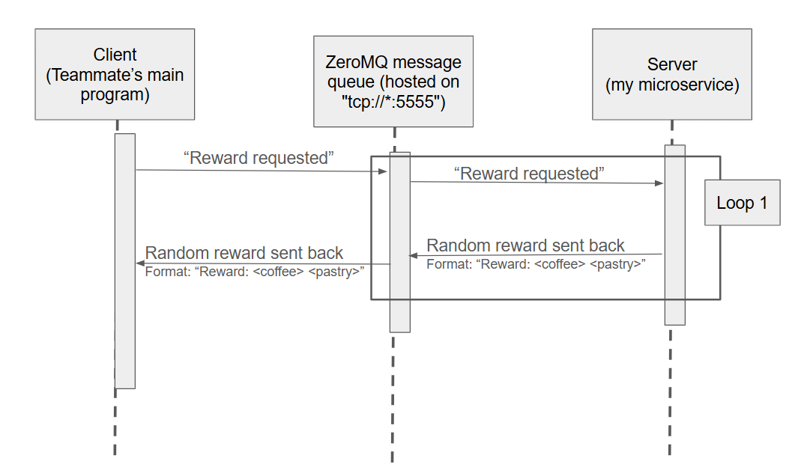

# Microservice A

## Description
Microservice A is a simple microservice that helps to generate random rewards for users in a specified format. The rewards are generated based on a random number generator, and different treats have different odds.

The format the rewards are generated in is: "Reward: <coffee> <pastry>", where <coffee> is a number between 1 and 12 formatted as a string. <pastry> is a string starting with P, and ending with a number 1-5, for example P1, or P5. Rewards are not specified in this microsercice, instead you as the developer will need to come up with your own rewards.

## How to run the microservice
1. Install & setup ZeroMQ (https://zeromq.org/download/)
2. Ensure pip is installed on your system as an active path (run pip --version in your terminal to check)
3. Run the server.py file (this is my microservice)
4. Run your own file that initiates a message to a message queue via a message broker (I used ZeroMQ)
5. The message should be in the format: "Requesting reward"
6. My microservice should respond with a message in the format: "Reward: <coffee> <pastry>"
7. Enjoy the treats of your labor!

## How to request data
import zmq
context = zmq.Context()
socket = context.socket(zmq.REQ)
socket.connect("tcp://localhost:5555")
socket.send_string("Requesting reward") -- This calls the microservice
message = socket.recv_string() -- This receives the response from the microservice
### Example
After a client sends "Requesting reward" the microservice could respond with:
"Reward: 12 P5"

## Note
I have included my client.py file in the repository. This is to ensure functionality and use as a reference for how to call the microservice.

## UML Diagram

